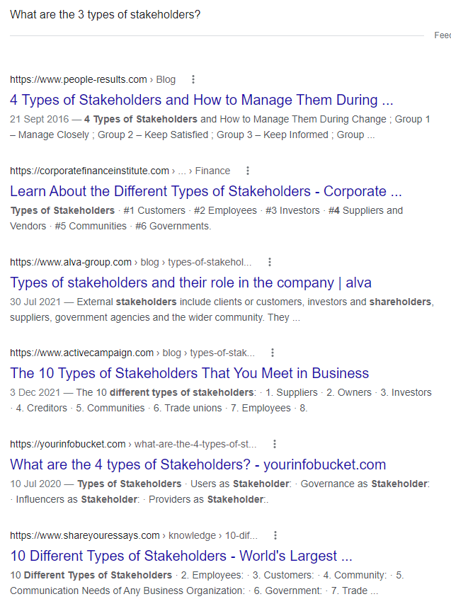

# Stakeholders:

    What Is a Stakeholder?

A stakeholder is a party that has an interest in a business or enterprise and can either affect or be affected by the business. 

Typical stakeholders are investors, employees, customers, suppliers, communities, governments, or trade associations. 

An entity's stakeholder(s) can be both internal or external to the organization. 

    The different types of stakeholders

Info is pretty conflicting on exactly how many types of stakeholders there are but here i've melted them all down to their base 4 categories to make things easier.

+ Users
+ Providers
+ Influencers
+ Governance 

These four categories of stakeholder-y-ness villainy make the acronym UPIG. Do what you will with this information idk. 

I mean really look at this shit. Idk man.

 

#

## Customers

+ Product information
  + The top 10 phones on sale
  + Cost price and resale value
  + Phone information: Parts, Version, Battery size etc...
+ Simple / Easy to access
  + Making sure the website isn't overly complicated for use
  + Easy to find when searching online and accessing the website
+ Easy to navigate
  + Search bar
  + Section tabs for products
  + Tag searching (I.e. Phones under a certain price, Specific brands and so on.)
+ Quick loading
  + Website loads fast preferable in 2 seconds or less

## Owners

+ Needs to look good
  + Well organized and designed space
  + Visually pleasing to look at (Not absolute dog vomit)
+ Professional
  + Same as previous just making sure everything is in order and not a jumbled mess
+ Generate business
  + Making sure that the website will be profitable with it's easy access and design
+ Cheap

## Developers

+ Well documented
  + Just making sure its all documented right
+ Maintainable
  + Making sure the website works
+ Easy to test
  + Its self explanatory
+ Follows standards
  + That it follows the standards of stuff man.

